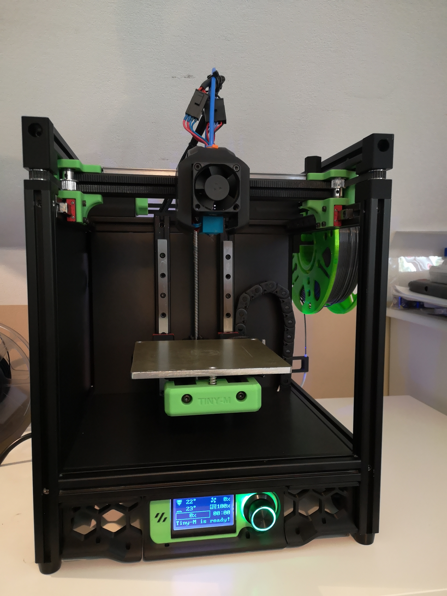
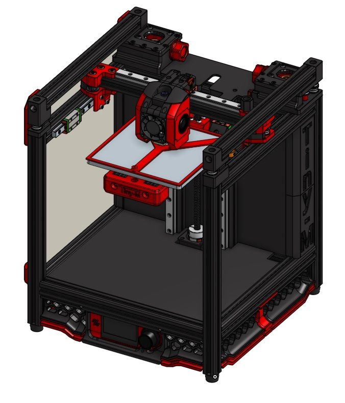
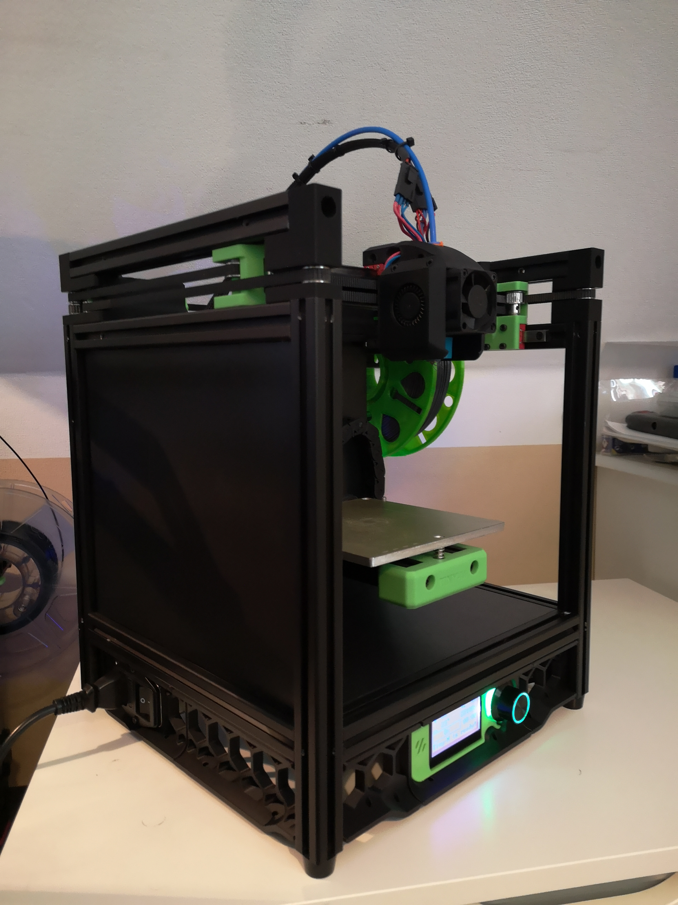
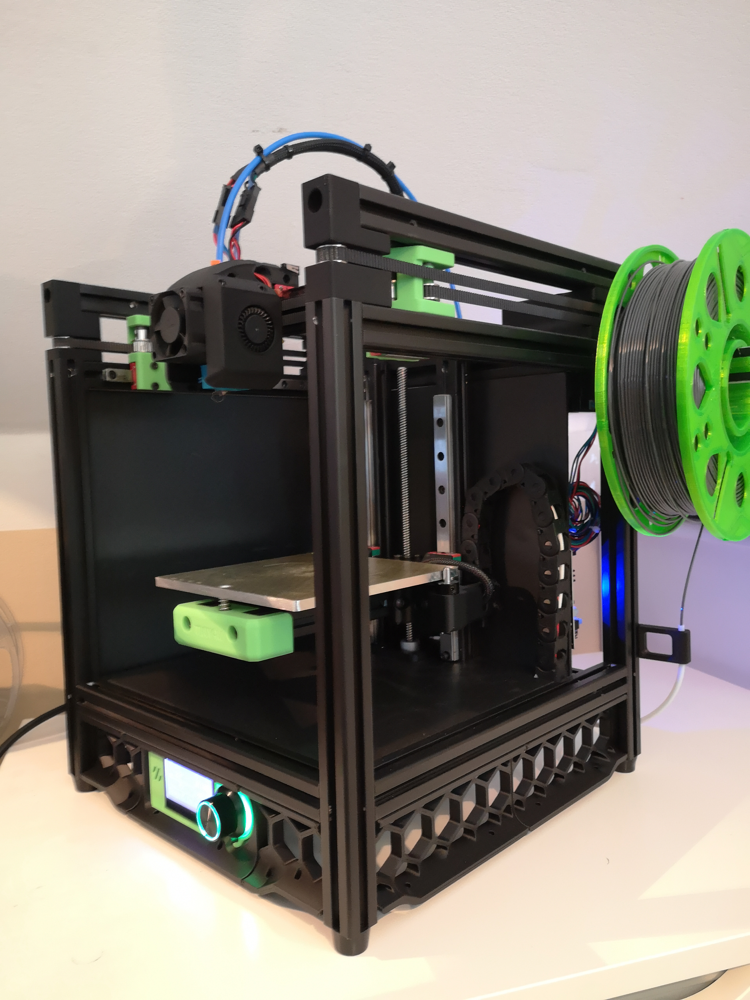

# Tiny-M

A compact printer with build volume: 150x150x150 mm

This is a Corona project.  
It is based on [Voron V0](https://github.com/VoronDesign/Voron-0) .  
As extruder I used [Voron Jetpack](https://github.com/VoronDesign/Jetpack-Extruder).
or my new [Nema17 Pocketwatch](https://github.com/gsl12/VoronUsers/tree/master/printer_mods/GSL12/pocketwatch_nema17)
A direct drive extruder using [Annex Engineering's Sherpa Mini](https://github.com/Annex-Engineering/Sherpa_Mini-Extruder) is now available.

### Current Version is V4:  

latest source whole printer:  [Tiny-M V4 Onshape](https://cad.onshape.com/documents/1523b676d2485ac19dbd60ec/w/d40ca3d72ed1f4079efb6497/e/a8deb399653e35f8f0a5baa5)

old source is available at [Tiny-M V3 Onshape](https://cad.onshape.com/documents/d2a24a4147c3d522115f6ea5/w/d8f44be5c0a081fbf527e154/e/debb6c2779e27f86389232d5).

This is my first project of this kind. Maybe something will be missing, is not well documented, or just messy. I apologize for that.

## Why the whole thing?

I had many 3D printer parts in my pocket from my old no longer used printer. 
I cleared out my pocket and took what I had in the box without buying anything new.
After checking all parts, I recognize, that I could build a converted Voron V0 with this parts.

### Hardware

    - 2020 Nut 5 I-Typ alu profiles (6mm wide slot Misumi 2020 will work).  Must have 4.0-4.2mm hole at ends.
    - Nema 17 stepper motors
    - 3x 200mm MGN9H for XY
    - 2x 200mm MGN12H for Z
    - FYSETC Cheetah V1.1b (TMC2209) or SKR Mini E3 with TMC2209
    - 24V everywhere

### BOM
DRAFT BOM is available now. Thanks to CookieSN !

WARNING ! The store Funssor on aliexpress sell a V0 kit with pictures of my Tiny-M. He use picture from github. To be clear IT IS NOT a Tiny-M Kit. Please don't buy it , if you want to build a Tiny-M.

### Build Tips
There are 3 versions of the XY-Joins.  V4 is recommended.

- V2 - use 2GT 20T pulleys - No Set Screw Hub
    - The outer diameter of the flanges from the pulleys for XY Joins will not fit.
    - You will need to grind the flanges to fit.
- V3 - use 2GT 20T toothed idler and no M5 Nuts
- V4 - split into 3 parts
    - removed one M5 screw for better alignment
    - optimized belt path to use E3D idler (10mm high) or chinese (9mm high)
    - some design changes
    - more rigid

Parts are best printed out of ABS or ABS+ with 0.4 nozzle with 0.48 extrusion width, 0.2-0.3 layer height, 5 top/bottom layers, 4 perimeters, 40% infill (triangular recommended).  Skirts can be printed out of pretty much any filament type.

[Mark Hoy's Excellent Build Log](https://github.com/mark-hoy/tiny-m-build)

[Aku's Build Pix](https://photos.google.com/share/AF1QipNcXcmM3RKy_vv-VFk4SFu25SVPCTLMsn6qd6mMj0eABvdKW5LyGL7gtdgspUF8wQ?key=Z04wNVNHN2dNYWpYLUVPYXBGT1JfNFBaMF9ObUNB)

### User Mods
There are several user mod STLs in the [usermods](https://github.com/gsl12/Tiny-M/tree/master/usermods) directory.

[190^3 Mod which uses Prusa mini bed plates](https://github.com/gsl12/Tiny-M/tree/master/usermods/190mm_prusa_mini_mod)

[Xile's Sherpa Direct Drive Toolhead](https://github.com/Annex-Engineering/Sherpa_Mini-Extruder/tree/master/Toolheads/Xile_Tiny_M)

[Ocho Camino's Sailfin Direct Drive Toolhead](https://github.com/CroXY3D/Sailfin-Extruder)

[5mm Shoulder Screw Mod](https://github.com/gsl12/Tiny-M/tree/master/usermods/shoulder_screw_mod)

[5mm Dowel Pin Mod](https://github.com/gsl12/Tiny-M/tree/master/usermods/5mm_idler_pins)

[Rear Cable Guide](https://github.com/gsl12/Tiny-M/tree/master/usermods/rear_cable_guide)

### Discord

The [CroXY Discord](https://discord.gg/tmZkjWs) has a tiny-m channel where several Tiny-M builders hang out.

# Images

V4  

 

old  

 

