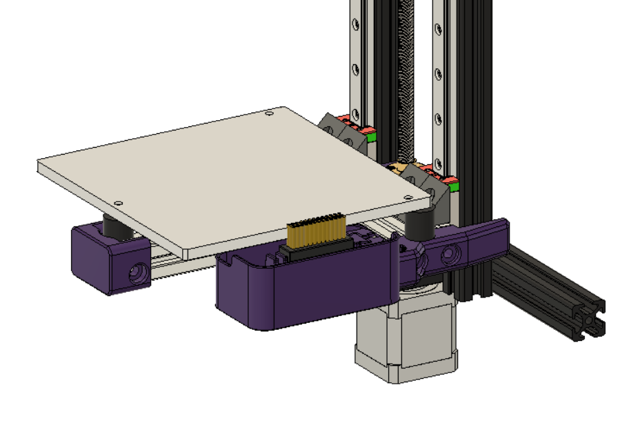

# Almost All Metal Bed Undercarriage with Purge Bucket

- @DanielO




## Rationale

The goal was to to create a all meter undercarriage mount inspired in the one created by @Ocho Camino, but using the default BOM extrusions e.g. 3x 130mm long for the 150mm2 version.

The purge bucket and brush were inspired in the [Annex purge bucket](https://github.com/Annex-Engineering/Other_Printer_Mods/tree/master/All_Printers/Purge_Brush_Bucket).

## Status

Tested and validated in a 150mm bed, though in retrospective some improvements could be made:

- move the z endstop a few milimets up in order to be able to use the default BOM 33mm long shaft.
- dimention the purge bucket for the 150mm bed, the available one might be too long.
- design a mount for a belted z mod

## Print Parts

Just need to print one of each STL/3mf.
And the [brush_holder_x1_rev1.STL](https://github.com/Annex-Engineering/Other_Printer_Mods/blob/master/All_Printers/Purge_Brush_Bucket/STLs/brush_holder_x1_rev1.STL) from Annex github.

## BOM

### 150mm Bed

- 3x 130mm long extrusions, from BOM
- 4x M5x8mm for the lead screw mount
- 2x M5x8mm for the from bed mount
- 4x M5x16mm for the side bed mounts
- 3x M5x30mm for holding the extrusions together
- 4x M3x18mm for holding the extrusions against the carts
- 4x M3x10mm and washers for holding the 90deg corners against the carts
- 4x M5x8mm for holding the 90deg corners against extrusions
- a few other M3x8mm for holding the cable chain and the brush
- 4x 6x3mm magnets for the bucket

### 190mm Bed

- not tested / adapted (but should be the same hardware and STLs as the 150mm)

## Klipper Macros for brush and bucket

Node: could and should be improved using variables

```clojure
[gcode_macro NOZZLE_CLEAN]
gcode:
    SAVE_GCODE_STATE NAME=nozzle_clean_state
    G1 X152 Y58 F3000
    G1 Z0.6     F3000
    ; Purge filament macro
    PURGE_FILAMENT
    G90
    ; clean twice
    G1 X152 Y58 F6000
    G1 Y105
    G1 Y58
    G1 Y105
    G1 Y58
    ; Retract
    ;G10
    ; clean once
    G1 Y105
    G1 Y58
    RESTORE_GCODE_STATE NAME=nozzle_clean_state
```

In START_PRINT macro do something like

```clojure
[gcode_macro START_PRINT]
gcode:
  ;================ SET VARIABLES ====================
  
  
  TURN_OFF_HEATERS
  M106 S0
  G21                           ; [mm] mode
  G90                           ; Absolute position mode
  M220 S100                     ; reset speed multiplier
  G92 E0                        ; reset e count
  M83                           ; relative Extruder mode
  ;================ INITIALISATION ====================
  G28                           ;  first homing
  ;================ WARM UP ===========================
  G1 X152 Y58 Z5 F3000          ; move nozzle to brush
  
      M190 S{params.T_BED|float*0.85}
  
  M140 S{T_BED}
  ;G1 X152 Y105 Z0.4 F3000      ; move to approx starting location
  M104 S{T_EXTRUDER|int - 30}   ; set no-ooze extruder temp
  M109 S{T_EXTRUDER|int - 30}   ; wait no-ooze for extruder temp
  ;----------------------- CLEANING---------------------------------
  NOZZLE_CLEAN                  ; call the macro that will clean the nozzle
  ;----------------------- PRECISE HOME-----------------------------
  G28 Z                         ; home z again with nozzle hot
  G1 X152 Y58 Z0.2 F3000        ; move to approx starting location
  ;----------------------- FINAL TEMPS -----------------------------
  M140 S{T_BED}                 ; set final bed temp
  M190 S{T_BED}                 ; wait for final bed temp
  M104 S{T_EXTRUDER}            ; set final extruder temp
  M109 S{T_EXTRUDER}            ; wait for final extruder temp
  ;-----------------------PRIMING-----------------------------------
  PRIME_LINE
  G10;
  G1 Y58                        ; rub on the brush one more time
  G1 Y105
  G1 Y58                        ; move to approx starting location
  G92 E0;                       ; set extruder to Zero
  G1 E0 F100
```
